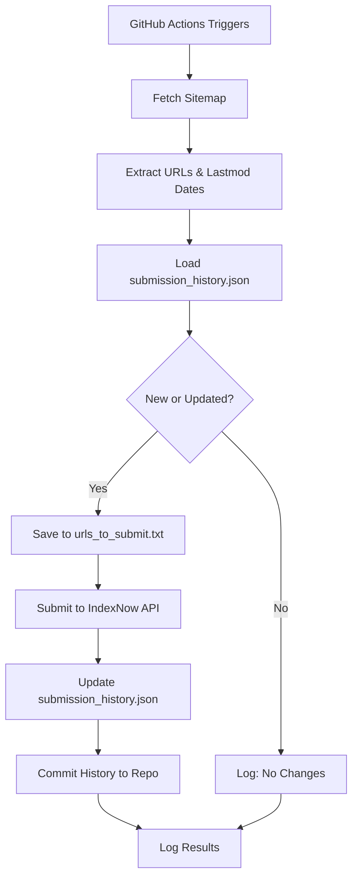

# 🔵 IndexNow Automatic URL Submitter

[](https://opensource.org/licenses/MIT)
[](https://www.python.org/downloads/)
[](https://github.com/features/actions)

Automated IndexNow submission system for any website. Runs every 30 minutes using GitHub Actions and submits **new and updated URLs** from your sitemap to improve SEO and speed up search engine indexing.

## 🚀 Quick Start Checklist

Before running the automation, complete these steps:

- [ ] Fork or clone this repository
- [ ] Generate an IndexNow API key
- [ ] Create and upload the key verification file to your website
- [ ] Add three GitHub Secrets (`INDEXNOW_API_KEY`, `SITE_URL`, `SITEMAP_URL`)
- [ ] **Clean tracking files** (delete contents of `submission_history.json` and `indexnow_log.txt`)
- [ ] Enable GitHub Actions workflow permissions (Read and write)
- [ ] Enable GitHub Actions in your repository
- [ ] Run the workflow manually to test (optional)
- [ ] Monitor the first run in Actions tab

---

## 📋 Overview

This repository automatically reads your sitemap, detects new URLs, and submits them to IndexNow-supported search engines:

- 🔍 **Bing**
- 🌐 **Yandex**
- 🇰🇷 **Naver**
- 🇨🇿 **Seznam**
- 🔗 **IndexNow partner engines**

By notifying search engines instantly about new content, you can improve SEO performance and ensure your pages get indexed faster.

---

## 🚀 Features

- ✅ Automatically fetches URLs from your sitemap (including nested sub-sitemaps)
- 🆕 Detects new and updated URLs (checks `lastmod` dates)
- 📤 Submits only changed URLs to IndexNow API
- 📊 Supports up to **10,000 URLs per batch**
- 💾 Stores:
  - Submission history with dates in JSON format (`submission_history.json`)
  - Newly detected URLs (`urls_to_submit.txt`)
  - Detailed logs of every run (`indexnow_log.txt`)
- ⏰ Runs automatically every 30 minutes using GitHub Actions
- 🔄 Auto-commits history back to repository for persistence
- 🔐 Fully secure using **GitHub Actions Secrets**
- 🚫 No sensitive information stored in the repository
- 🐛 Enhanced debug logging for troubleshooting

---

## 📂 Repository Structure

```
.
├── indexnow.py                 # Main Python script with smart change detection
├── submission_history.json     # History of submitted URLs with lastmod dates
├── urls_to_submit.txt          # Newly detected URLs awaiting submission
├── indexnow_log.txt            # Detailed runtime logs with debug info
├── .github/
│   └── workflows/
│       └── indexnow.yml        # GitHub Actions workflow configuration
└── README.md                   # This file
```

---

## 🔧 Requirements

### Prerequisites

- A GitHub account
- A website with a publicly accessible sitemap
- An IndexNow API key

### GitHub Secrets

This script requires **three GitHub Secrets**:

| Secret Name          | Description                                      | Example                                    |
|----------------------|--------------------------------------------------|--------------------------------------------|
| `INDEXNOW_API_KEY`   | Your IndexNow API key                            | `b56754fc06724b35b8e2345783e5fbb9a`        |
| `SITE_URL`           | Your website URL (without trailing slash)        | `https://neovise.me`                       |
| `SITEMAP_URL`        | Your sitemap URL                                 | `https://neovise.me/sitemap.xml`           |

---

## 🛠 Setup Instructions

### Step 1: Fork or Clone This Repository

Click the **Fork** button at the top of this page, or clone it:

```bash
git clone https://github.com/gavirubihan/indexnow-github-actions.git
cd indexnow-github-actions
```

### Step 2: Generate an IndexNow API Key

1. Visit [IndexNow.org](https://www.bing.com/indexnow/getstarted) or generate a random 32-character hexadecimal key
2. Example: `b56754fc06724b35b8e2345783e5fbb9a`

### Step 3: Create the IndexNow Key File on Your Website

IndexNow requires a public verification file on your website:

**File location:**
```
https://your-site.com/YOUR_INDEXNOW_KEY.txt
```

**Example:**
```
https://neovise.me/b56754fc06724b35b8e2345783e5fbb9a.txt
```

**File contents** (plain text, only your key):
```
b56754fc06724b35b8e2345783e5fbb9a
```

Upload this file to your website's root directory and ensure it's publicly accessible.

### Step 4: Configure GitHub Secrets

1. Go to your forked repository on GitHub
2. Navigate to **Settings** → **Secrets and variables** → **Actions**
3. Click **New repository secret** and add these three secrets:

#### `INDEXNOW_API_KEY`
```
b56754fc06724b35b8e2345783e5fbb9a
```

#### `SITE_URL`
```
https://neovise.me
```

#### `SITEMAP_URL`
```
https://neovise.me/sitemap.xml
```

### Step 5: Enable GitHub Actions Permissions

**CRITICAL STEP:** The workflow needs write permissions to commit the updated history file.

1. Go to **Settings** → **Actions** → **General**
2. Scroll down to **Workflow permissions**
3. Select **"Read and write permissions"**
4. Check **"Allow GitHub Actions to create and approve pull requests"** (optional)
5. Click **Save**

### Step 6: Clean the Tracking Files

**IMPORTANT:** Before running the script for the first time, clean the tracking files:

1. Open these files in your repository:
   - `submission_history.json`
   - `indexnow_log.txt`
   - `urls_to_submit.txt`

2. **Delete all content** inside each file (make them completely empty)

3. Commit the changes:
   ```bash
   git add submission_history.json indexnow_log.txt urls_to_submit.txt
   git commit -m "Clean tracking files for first run"
   git push
   ```

**Why?** These files may contain example data or test URLs. Cleaning them ensures your automation starts fresh with only your actual website URLs.

### Step 7: Enable GitHub Actions

1. Go to the **Actions** tab in your repository
2. Click **I understand my workflows, go ahead and enable them**
3. The workflow will now run automatically every 30 minutes

---

## ⚙️ GitHub Actions Automation

The included workflow (`.github/workflows/indexnow.yml`) automatically:

1. ✅ Checks out the repository
2. 🐍 Installs Python 3.10
3. 📦 Installs required dependencies (`requests`)
4. 🔄 Runs the IndexNow submission script
5. 📤 Submits new/updated URLs to IndexNow
6. 💾 Saves logs and updates URL history
7. 🔁 **Commits `submission_history.json` back to the repository**
8. 📊 Uploads artifacts for debugging

**Default Schedule:** Every 30 minutes

### How History Persistence Works

The workflow includes a critical step that commits the updated `submission_history.json` back to the repository:

```yaml
- name: Commit updated history
  run: |
    git config user.name "GitHub Actions Bot"
    git config user.email "actions@github.com"
    git add submission_history.json indexnow_log.txt urls_to_submit.txt || true
    if ! git diff --cached --quiet; then
      git commit -m "Update IndexNow submission history [skip ci]"
      git push
    fi
```

This ensures that:
- ✅ Previously submitted URLs are remembered between runs
- ✅ Only new or updated content is submitted
- ✅ No duplicate submissions occur
- ✅ The `[skip ci]` tag prevents infinite workflow loops

### Manual Trigger

You can also manually trigger the workflow:

1. Go to **Actions** tab
2. Select **IndexNow Auto Submission**
3. Click **Run workflow**
4. Select branch and click **Run workflow**

---

## 🧠 How It Works



**Detailed Process:**

1. **Fetch Sitemap:** Downloads your sitemap XML file (supports sitemap indexes with sub-sitemaps)
2. **Parse URLs:** Extracts all `<loc>` URLs and `<lastmod>` dates from all sitemaps
3. **Load History:** Reads `submission_history.json` containing previously submitted URLs and their dates
4. **Compare Dates:** For each URL, compares sitemap `lastmod` with stored date
5. **Detect Changes:** Identifies:
   - **New URLs** (not in history)
   - **Updated URLs** (sitemap lastmod > stored lastmod)
6. **Save:** Writes eligible URLs to `urls_to_submit.txt`
7. **Submit:** Sends URLs to IndexNow API endpoint in a single batch
8. **Update History:** Saves new lastmod dates to `submission_history.json`
9. **Commit:** GitHub Actions commits updated history back to repository
10. **Log:** Records all activities with timestamps and debug info in `indexnow_log.txt`

### Smart Change Detection

The script uses intelligent date comparison:

```python
# Example: Only submits if content was updated
Sitemap lastmod: 2025-11-30T03:08:57.022Z
History lastmod: 2025-11-16T12:49:14.000Z
Action: SUBMIT (content was updated)

Sitemap lastmod: 2025-11-29T02:18:01.000Z  
History lastmod: 2025-11-29T02:18:01.000Z
Action: SKIP (no changes)
```

---

## 📜 Logs and Monitoring

### Log Files

The script generates three tracking files:

| File                    | Purpose                                      | Format |
|-------------------------|----------------------------------------------|--------|
| `submission_history.json` | Records all submitted URLs with their lastmod dates | JSON |
| `urls_to_submit.txt`    | New/Updated URLs detected in the current run | Plain text |
| `indexnow_log.txt`      | Detailed logs with timestamps and debug info | Plain text |

### Example Log Output

```
[2025-11-30 04:46:53] Fetching sitemap from https://neovise.me/sitemap.xml
[2025-11-30 04:46:53] Found sub-sitemap: https://neovise.me/sitemap-posts.xml
[2025-11-30 04:46:53] Loaded history for 76 URLs
[2025-11-30 04:46:53] Updated content: https://neovise.me/article/ (2025-11-30 > 2025-11-29)
[2025-11-30 04:46:53] Submitting 2 URLs...
[2025-11-30 04:46:53] DEBUG: Response status: 200
[2025-11-30 04:46:53] SUCCESS: 2 URLs submitted
[2025-11-30 04:46:53] DEBUG: Updated 2 URLs in history dict
[2025-11-30 04:46:53] Saved history to submission_history.json
```

### Viewing Logs

**In GitHub Actions:**
1. Go to **Actions** tab
2. Click on any workflow run
3. Click on the job name
4. Expand log sections to view output

**Download Artifacts:**
1. Scroll to the bottom of the workflow run
2. Download **indexnow-logs** artifact
3. Extract and view `indexnow_log.txt`

**In Repository:**
- View `indexnow_log.txt` directly in your repo for historical logs
- View `submission_history.json` to see all submitted URLs and dates

---

## 🔄 Customizing the Schedule

To change how often the script runs, edit `.github/workflows/indexnow.yml`:

```yaml
on:
  schedule:
    - cron: '*/30 * * * *'  # Every 30 minutes
```

### Common Cron Schedules

| Interval                | Cron Expression     |
|-------------------------|---------------------|
| Every 10 minutes        | `*/10 * * * *`      |
| Every hour              | `0 * * * *`         |
| Every 6 hours           | `0 */6 * * *`       |
| Daily at 3:00 AM UTC    | `0 3 * * *`         |
| Twice daily (6AM, 6PM)  | `0 6,18 * * *`      |

**Note:** GitHub Actions may have a slight delay (up to 15 minutes) during high usage periods.

---

## 🛠 Troubleshooting

### Common Issues

#### ❌ Error: "indexnow.py: No such file or directory"

**Solution:** Ensure `indexnow.py` is in the repository root folder, not in a subdirectory.

#### ❌ History file not updating / Same URLs submitted repeatedly

**Symptoms:**
- Log shows "Updated content" for the same URLs every run
- `submission_history.json` file modification date doesn't change
- Same URLs appear in every workflow run

**Root Cause:** The workflow doesn't have permission to commit changes, or the commit step is failing.

**Solutions:**

1. **Enable Write Permissions** (Most Common Fix):
   - Go to **Settings** → **Actions** → **General**
   - Under "Workflow permissions", select **"Read and write permissions"**
   - Click **Save**

2. **Verify Commit Step in Logs:**
   - Check Actions logs for "✅ History updated and pushed"
   - If you see errors about git push failing, permissions aren't set correctly

3. **Check for `[skip ci]` Tag:**
   - The commit message includes `[skip ci]` to prevent infinite loops
   - If missing, the workflow might trigger itself repeatedly

4. **Manual Verification:**
   ```bash
   # Check if file was updated
   git log --oneline -5 submission_history.json
   # Should show recent commits by "GitHub Actions Bot"
   ```

#### ❌ HTTP 403 or 422: Key verification failed

**Solution:** 
- Verify your IndexNow key file exists at `https://your-site.com/YOUR_KEY.txt`
- Ensure the file contains only the key (no extra spaces or characters)
- Check that `INDEXNOW_API_KEY` secret matches the key file exactly
- Test the key file URL in a browser to confirm it's publicly accessible

#### ❌ "No URLs found in sitemap"

**Solution:**
- Verify your sitemap URL is correct and publicly accessible
- Test the sitemap URL in a browser
- Ensure the sitemap is valid XML format
- Check for namespace issues (the script handles both with and without namespaces)

#### ❌ "Permission denied" when committing

**Solution:**
- Follow Step 5 in Setup Instructions to enable write permissions
- Ensure the workflow has `permissions: contents: write` in the YAML file

#### ⚠️ Workflow not running automatically

**Solution:**
- Ensure GitHub Actions is enabled for your repository
- Check that the workflow file is in `.github/workflows/` directory
- Verify the YAML syntax is correct (use a YAML validator)
- Check if the repository has any branch protection rules blocking Actions

#### 🐛 Debug Mode

To get detailed debug information, check `indexnow_log.txt` for these lines:

```
DEBUG: Payload host: your-site.com
DEBUG: Response status: 200
DEBUG: Submission success = True
DEBUG: Updated X URLs in history dict
DEBUG: save_submission_history returned True
```

---

## 📊 API Limits and Best Practices

### IndexNow Limits

- Maximum **10,000 URLs** per submission
- Rate limiting may apply (429 status code triggers automatic retry)
- Multiple submissions of the same URL are harmless but unnecessary

### Best Practices

- ✅ Submit only when you have new content (this script does this automatically)
- ✅ Use a consistent sitemap structure with accurate `lastmod` dates
- ✅ Keep your sitemap updated and accessible
- ✅ Monitor logs for any errors
- ✅ Run at reasonable intervals (30 minutes is optimal)
- ❌ Don't submit the same URLs repeatedly (the script prevents this)
- ❌ Don't spam the API with empty submissions
- ❌ Don't manually edit `submission_history.json` (let the script manage it)

### What Happens During Each Run

**Scenario 1: New Content**
```
✅ Fetches sitemap
✅ Finds 2 new URLs
✅ Submits to IndexNow (Status: 200)
✅ Updates history
✅ Commits changes
```

**Scenario 2: No Changes**
```
✅ Fetches sitemap
ℹ️ No new or updated content
⏭️ Skips submission
⏭️ No changes to commit
```

**Scenario 3: Updated Content**
```
✅ Fetches sitemap
✅ Detects URL with newer lastmod date
✅ Submits to IndexNow
✅ Updates history with new date
✅ Commits changes
```

---

## 🔒 Security Considerations

- 🔐 All sensitive data is stored in GitHub Secrets (encrypted)
- 🚫 No API keys or URLs are exposed in the code
- ✅ Secrets are never logged or printed
- 🔒 Repository can be public without security risks
- ✅ Workflow uses `[skip ci]` to prevent infinite loops
- 🔐 GitHub Actions Bot identity used for commits

---

## 📄 License

This project is licensed under the MIT License - see below for details:

```
MIT License

Copyright (c) 2024 IndexNow Auto Submitter Contributors

Permission is hereby granted, free of charge, to any person obtaining a copy
of this software and associated documentation files (the "Software"), to deal
in the Software without restriction, including without limitation the rights
to use, copy, modify, merge, publish, distribute, sublicense, and/or sell
copies of the Software, and to permit persons to whom the Software is
furnished to do so, subject to the following conditions:

The above copyright notice and this permission notice shall be included in all
copies or substantial portions of the Software.

THE SOFTWARE IS PROVIDED "AS IS", WITHOUT WARRANTY OF ANY KIND, EXPRESS OR
IMPLIED, INCLUDING BUT NOT LIMITED TO THE WARRANTIES OF MERCHANTABILITY,
FITNESS FOR A PARTICULAR PURPOSE AND NONINFRINGEMENT. IN NO EVENT SHALL THE
AUTHORS OR COPYRIGHT HOLDERS BE LIABLE FOR ANY CLAIM, DAMAGES OR OTHER
LIABILITY, WHETHER IN AN ACTION OF CONTRACT, TORT OR OTHERWISE, ARISING FROM,
OUT OF OR IN CONNECTION WITH THE SOFTWARE OR THE USE OR OTHER DEALINGS IN THE
SOFTWARE.
```

---

## 🤝 Contributing

Contributions are welcome! Here's how you can help:

1. 🍴 Fork the repository
2. 🌿 Create a feature branch (`git checkout -b feature/AmazingFeature`)
3. 💾 Commit your changes (`git commit -m 'Add some AmazingFeature'`)
4. 📤 Push to the branch (`git push origin feature/AmazingFeature`)
5. 🔀 Open a Pull Request

### Ideas for Contributions

- Support for additional search engines
- Error notification system (email/Slack/Discord)
- URL filtering options (include/exclude patterns)
- Statistics dashboard
- Multi-sitemap support improvements
- Docker containerization
- Web UI for monitoring
- Retry logic enhancements

---

## 📞 Support

If you encounter any issues or have questions:

- 🐛 **Bug Reports:** [Open an issue](https://github.com/gavirubihan/indexnow-github-actions/issues)
- 💡 **Feature Requests:** [Open an issue](https://github.com/gavirubihan/indexnow-github-actions/issues)
- 📧 **Questions:** Check existing issues or create a new one
- 📖 **Documentation:** Read this README thoroughly

---

## 🌟 Show Your Support

If this project helped you, please consider:

- ⭐ Starring the repository
- 🍴 Forking it for your own use
- 📢 Sharing it with others
- 🤝 Contributing improvements
- 💬 Providing feedback

---

## 📚 Additional Resources

- [IndexNow Official Documentation](https://www.indexnow.org/documentation)
- [IndexNow FAQ](https://www.indexnow.org/faq)
- [GitHub Actions Documentation](https://docs.github.com/en/actions)
- [GitHub Actions Permissions](https://docs.github.com/en/actions/security-guides/automatic-token-authentication#permissions-for-the-github_token)
- [Sitemap Protocol](https://www.sitemaps.org/protocol.html)
- [Cron Expression Guide](https://crontab.guru/)
- [Python Requests Library](https://requests.readthedocs.io/)

---

## 🔄 Changelog

### v2.0 (Current)
- ✅ Migrated from `submitted_urls.txt` to `submission_history.json`
- ✅ Added smart change detection using lastmod dates
- ✅ Enhanced debug logging
- ✅ Auto-commit history back to repository
- ✅ Improved error handling
- ✅ Better workflow permissions handling
- ✅ Added `[skip ci]` to prevent infinite loops

### v1.0
- ✅ Initial release
- ✅ Basic URL submission
- ✅ Simple tracking with text file

---

## 🌐 Author

Created to improve SEO and indexing speed using IndexNow and GitHub Actions automation.

**Maintained by:** [Gaviru Bihan](https://github.com/gavirubihan)

---

<div align="center">

**Made with ❤️ for better SEO**

[⬆ Back to Top](#-indexnow-automatic-url-submitter)

</div>