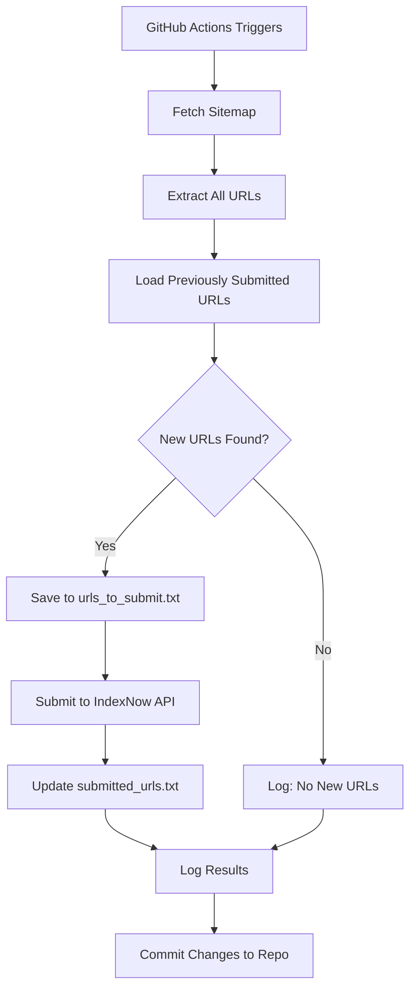

# 🔵 IndexNow Automatic URL Submitter

[](https://opensource.org/licenses/MIT)
[](https://www.python.org/downloads/)
[](https://github.com/features/actions)

Automated IndexNow submission system for any website. Runs every 30 minutes using GitHub Actions and submits **only new URLs** from your sitemap to improve SEO and speed up search engine indexing.

## 🚀 Quick Start Checklist

Before running the automation, complete these steps:

- [ ] Fork or clone this repository
- [ ] Generate an IndexNow API key
- [ ] Create and upload the key verification file to your website
- [ ] Add three GitHub Secrets (`INDEXNOW_API_KEY`, `SITE_URL`, `SITEMAP_URL`)
- [ ] **Clean all `.txt` files** (delete their contents completely)
- [ ] Enable GitHub Actions in your repository
- [ ] Run the workflow manually to test (optional)
- [ ] Monitor the first run in Actions tab

---

## 📋 Overview

This repository automatically reads your sitemap, detects new URLs, and submits them to IndexNow-supported search engines:

- 🔍 **Bing**
- 🌐 **Yandex**
- 🇰🇷 **Naver**
- 🇨🇿 **Seznam**
- 🔗 **IndexNow partner engines**

By notifying search engines instantly about new content, you can improve SEO performance and ensure your pages get indexed faster.

---

## 🚀 Features

- ✅ Automatically fetches URLs from your sitemap (including nested sub-sitemaps)
- 🆕 Detects new URLs since the last submission
- 📤 Submits only new URLs to IndexNow API
- 📊 Supports up to **10,000 URLs per batch**
- 💾 Stores:
  - Submitted URL history (`submitted_urls.txt`)
  - Newly detected URLs (`urls_to_submit.txt`)
  - Detailed logs of every run (`indexnow_log.txt`)
- ⏰ Runs automatically every 30 minutes using GitHub Actions
- 🔐 Fully secure using **GitHub Actions Secrets**
- 🚫 No sensitive information stored in the repository

---

## 📂 Repository Structure

```
.
├── indexnow.py                 # Main Python script
├── submitted_urls.txt          # History of all submitted URLs
├── urls_to_submit.txt          # Newly detected URLs awaiting submission
├── indexnow_log.txt            # Detailed runtime logs
├── .github/
│   └── workflows/
│       └── indexnow.yml        # GitHub Actions workflow configuration
└── README.md                   # This file
```

---

## 🔧 Requirements

### Prerequisites

- A GitHub account
- A website with a publicly accessible sitemap
- An IndexNow API key

### GitHub Secrets

This script requires **three GitHub Secrets**:

| Secret Name          | Description                                      | Example                                    |
|----------------------|--------------------------------------------------|--------------------------------------------|
| `INDEXNOW_API_KEY`   | Your IndexNow API key                            | `b72854fc06724b35b8e572783e5fbb9a`        |
| `SITE_URL`           | Your website URL (without trailing slash)        | `https://neovise.me`                       |
| `SITEMAP_URL`        | Your sitemap URL                                 | `https://neovise.me/sitemap.xml`           |

---

## 🛠 Setup Instructions

### Step 1: Fork or Clone This Repository

Click the **Fork** button at the top of this page, or clone it:

```bash
git clone https://github.com/yourusername/indexnow-submitter.git
cd indexnow-submitter
```

### Step 2: Generate an IndexNow API Key

1. Visit [IndexNow.org](https://www.indexnow.org/) or generate a random 32-character hexadecimal key
2. Example: `b72854fc06724b35b8e572783e5fbb9a`

### Step 3: Create the IndexNow Key File on Your Website

IndexNow requires a public verification file on your website:

**File location:**
```
https://your-site.com/YOUR_INDEXNOW_KEY.txt
```

**Example:**
```
https://neovise.me/b72854fc06724b35b8e572783e5fbb9a.txt
```

**File contents** (plain text, only your key):
```
b72854fc06724b35b8e572783e5fbb9a
```

Upload this file to your website's root directory and ensure it's publicly accessible.

### Step 4: Configure GitHub Secrets

1. Go to your forked repository on GitHub
2. Navigate to **Settings** → **Secrets and variables** → **Actions**
3. Click **New repository secret** and add these three secrets:

#### `INDEXNOW_API_KEY`
```
b72854fc06724b35b8e572783e5fbb9a
```

#### `SITE_URL`
```
https://neovise.me
```

#### `SITEMAP_URL`
```
https://neovise.me/sitemap.xml
```

### Step 5: Clean the Tracking Files

**IMPORTANT:** Before running the script for the first time, clean all `.txt` files:

1. Open each of these files in your repository:
   - `submitted_urls.txt`
   - `urls_to_submit.txt`
   - `indexnow_log.txt`

2. **Delete all content** inside each file (make them completely empty)

3. Commit the changes:
   ```bash
   git add *.txt
   git commit -m "Clean tracking files for first run"
   git push
   ```

**Why?** These files may contain example data or test URLs. Cleaning them ensures your automation starts fresh with only your actual website URLs.

### Step 6: Enable GitHub Actions

1. Go to the **Actions** tab in your repository
2. Click **I understand my workflows, go ahead and enable them**
3. The workflow will now run automatically every 30 minutes

---

## ⚙️ GitHub Actions Automation

The included workflow (`.github/workflows/indexnow.yml`) automatically:

1. ✅ Installs Python 3.x
2. 📦 Installs required dependencies
3. 🔄 Runs the IndexNow submission script
4. 📤 Submits new URLs to IndexNow
5. 💾 Saves logs and updates URL history
6. 🔁 Commits changes back to the repository

**Default Schedule:** Every 30 minutes

### Manual Trigger

You can also manually trigger the workflow:

1. Go to **Actions** tab
2. Select **IndexNow Auto Submission**
3. Click **Run workflow**
4. Select branch and click **Run workflow**

---

## 🧠 How It Works



**Detailed Process:**

1. **Fetch Sitemap:** Downloads your sitemap XML file
2. **Parse URLs:** Extracts all `<loc>` URLs (including from nested sitemaps)
3. **Compare:** Reads `submitted_urls.txt` to identify new URLs
4. **Detect New URLs:** Filters out already-submitted URLs
5. **Save:** Writes new URLs to `urls_to_submit.txt`
6. **Submit:** Sends URLs to IndexNow API endpoint
7. **Update History:** Adds submitted URLs to `submitted_urls.txt`
8. **Log:** Records all activities in `indexnow_log.txt`
9. **Commit:** GitHub Actions commits updated files automatically

---

## 📜 Logs and Monitoring

### Log Files

The script generates three tracking files:

| File                    | Purpose                                      |
|-------------------------|----------------------------------------------|
| `submitted_urls.txt`    | Historical record of all submitted URLs      |
| `urls_to_submit.txt`    | New URLs detected in the current run         |
| `indexnow_log.txt`      | Detailed logs with timestamps and status     |

### Viewing Logs

**In GitHub Actions:**
1. Go to **Actions** tab
2. Click on any workflow run
3. Click on the job name
4. Expand log sections to view output

**In Repository:**
- View `indexnow_log.txt` directly in your repo for historical logs

---

## 🔄 Customizing the Schedule

To change how often the script runs, edit `.github/workflows/indexnow.yml`:

```yaml
on:
  schedule:
    - cron: '*/30 * * * *'  # Every 30 minutes
```

### Common Cron Schedules

| Interval                | Cron Expression     |
|-------------------------|---------------------|
| Every 10 minutes        | `*/10 * * * *`      |
| Every hour              | `0 * * * *`         |
| Every 6 hours           | `0 */6 * * *`       |
| Daily at 3:00 AM UTC    | `0 3 * * *`         |
| Twice daily (6AM, 6PM)  | `0 6,18 * * *`      |

**Note:** GitHub Actions may have a slight delay (up to 15 minutes) during high usage periods.

---

## 🛠 Troubleshooting

### Common Issues

#### ❌ Error: "indexnow.py: No such file or directory"

**Solution:** Ensure `indexnow.py` is in the repository root folder, not in a subdirectory.

#### ❌ Script submitting wrong URLs or old data

**Solution:** 
- Clean all `.txt` files before first run (see Step 5 in Setup Instructions)
- Ensure `submitted_urls.txt` doesn't contain test/example URLs
- Delete content from all tracking files and let the script rebuild them fresh

#### ❌ HTTP 403 or 422: Key verification failed

**Solution:** 
- Verify your IndexNow key file exists at `https://your-site.com/YOUR_KEY.txt`
- Ensure the file contains only the key (no extra spaces or characters)
- Check that `INDEXNOW_API_KEY` secret matches the key file exactly

#### ❌ "No URLs found in sitemap"

**Solution:**
- Verify your sitemap URL is correct and publicly accessible
- Test the sitemap URL in a browser
- Ensure the sitemap is valid XML format

#### ❌ "Permission denied" when committing

**Solution:**
- Go to **Settings** → **Actions** → **General**
- Under "Workflow permissions", select "Read and write permissions"
- Click **Save**

#### ⚠️ Workflow not running automatically

**Solution:**
- Ensure GitHub Actions is enabled for your repository
- Check that the workflow file is in `.github/workflows/` directory
- Verify the YAML syntax is correct

---

## 📊 API Limits and Best Practices

### IndexNow Limits

- Maximum **10,000 URLs** per submission
- Recommended to avoid excessive requests (our 30-minute schedule is safe)
- Multiple submissions of the same URL are harmless but unnecessary

### Best Practices

- ✅ Submit only when you have new content
- ✅ Use a consistent sitemap structure
- ✅ Keep your sitemap updated and accessible
- ✅ Monitor logs for any errors
- ❌ Don't submit the same URLs repeatedly
- ❌ Don't spam the API with empty submissions

---

## 🔒 Security Considerations

- 🔐 All sensitive data is stored in GitHub Secrets (encrypted)
- 🚫 No API keys or URLs are exposed in the code
- ✅ Secrets are never logged or printed
- 🔒 Repository can be public without security risks

---

## 📄 License

This project is licensed under the MIT License - see below for details:

```
MIT License

Copyright (c) 2024 IndexNow Auto Submitter Contributors

Permission is hereby granted, free of charge, to any person obtaining a copy
of this software and associated documentation files (the "Software"), to deal
in the Software without restriction, including without limitation the rights
to use, copy, modify, merge, publish, distribute, sublicense, and/or sell
copies of the Software, and to permit persons to whom the Software is
furnished to do so, subject to the following conditions:

The above copyright notice and this permission notice shall be included in all
copies or substantial portions of the Software.

THE SOFTWARE IS PROVIDED "AS IS", WITHOUT WARRANTY OF ANY KIND, EXPRESS OR
IMPLIED, INCLUDING BUT NOT LIMITED TO THE WARRANTIES OF MERCHANTABILITY,
FITNESS FOR A PARTICULAR PURPOSE AND NONINFRINGEMENT. IN NO EVENT SHALL THE
AUTHORS OR COPYRIGHT HOLDERS BE LIABLE FOR ANY CLAIM, DAMAGES OR OTHER
LIABILITY, WHETHER IN AN ACTION OF CONTRACT, TORT OR OTHERWISE, ARISING FROM,
OUT OF OR IN CONNECTION WITH THE SOFTWARE OR THE USE OR OTHER DEALINGS IN THE
SOFTWARE.
```

---

## 🤝 Contributing

Contributions are welcome! Here's how you can help:

1. 🍴 Fork the repository
2. 🌿 Create a feature branch (`git checkout -b feature/AmazingFeature`)
3. 💾 Commit your changes (`git commit -m 'Add some AmazingFeature'`)
4. 📤 Push to the branch (`git push origin feature/AmazingFeature`)
5. 🔀 Open a Pull Request

### Ideas for Contributions

- Support for additional search engines
- Error notification system (email/Slack)
- URL filtering options
- Statistics dashboard
- Multi-sitemap support
- Docker containerization

---

## 📞 Support

If you encounter any issues or have questions:

- 🐛 **Bug Reports:** [Open an issue](https://github.com/yourusername/indexnow-submitter/issues)
- 💡 **Feature Requests:** [Open an issue](https://github.com/yourusername/indexnow-submitter/issues)
- 📧 **Questions:** Check existing issues or create a new one

---

## 🌟 Show Your Support

If this project helped you, please consider:

- ⭐ Starring the repository
- 🍴 Forking it for your own use
- 📢 Sharing it with others
- 🤝 Contributing improvements

---

## 📚 Additional Resources

- [IndexNow Official Documentation](https://www.indexnow.org/documentation)
- [GitHub Actions Documentation](https://docs.github.com/en/actions)
- [Sitemap Protocol](https://www.sitemaps.org/protocol.html)
- [Cron Expression Guide](https://crontab.guru/)

---

## 🌐 Author

Created to improve SEO and indexing speed using IndexNow and GitHub Actions automation.

**Maintained by:** [Your Name/Organization]

---

<div align="center">

**Made with ❤️ for better SEO**

[⬆ Back to Top](#-indexnow-automatic-url-submitter)

</div>